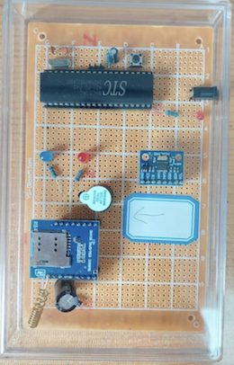

# 公益智能跌倒检测装置

###### You may use the browser's webpage translation feature to translate the content into other languages🙂.

###### （The pictures on this page may may take some time to load. Thanks for your patience.)

## 产品 
#### 这是一个为低收入老年人，残疾人提供的免费跌倒检测报警装置
##### Version1.0

 

---
想要知道关于产品的详细信息？点击下方链接！
####  👉[产品详细信息](https://esperaa.github.io/fallingdetect/)

---

怎么使用？其他信息？尽在下方链接！
#### 👉[产品说明书](https://esperaa.github.io/WebextensionforAutome-/)

---
#### Initiative for developing these Free devices:

**_These devices are developed for: The elderly, disables and children._**
###### Falling acidents often occur among elderly people. When they are alone at home or elsewhere, falling could be dangerous to them since they may get injuried without prompt cures. Some technology companies have developed intelligent watches possess the function of detecting fallings. However, there are always elderly people that cannot afford the expansive watches. Moreover, intelligent watches not easy for some of them to use. To solve this problem, I am keeping dedicating to develop a automatic fall-accident detection device, which only has one function (which is easy to use ): precisely detect the accidents and tell the emergence to their family members or others. Currently, this device is free. // The cost of making such a device is only 1/15 of buying a watch. I will keep improving the device in both the aspect of hardware and software to make it more practical.

---

#### 反馈
想要反馈信息？或者想要预定产品？
###### 👉你可以通过邮箱联系我: Fall_detectemail@qq.com

### 你也可以关注我的公众号获得资讯!

> **感兴趣?**
> 
> 关注我的公众号[「智能与机械探索」](https://esperaa.github.io/WebextensionforAutome-/)and DM to me!
> 

#### 问卷调查链接（用于获得意见，进行创新及改善）
##### 感谢你的支持！

-问卷链接1: 关于设计初代跌倒检测报警装置
###### ➡️[点击填写问卷1](https://v.wjx.cn/vm/Q2Frjo2.aspx#)📝

-问卷链接2: 对于1代使用者的调查
###### 👉[点击填写问卷2](https://www.wjx.cn/vm/Q72F9Z0.aspx# )

---

#### Copyright

**_© 2024 Esper.S All rights reserved._**

