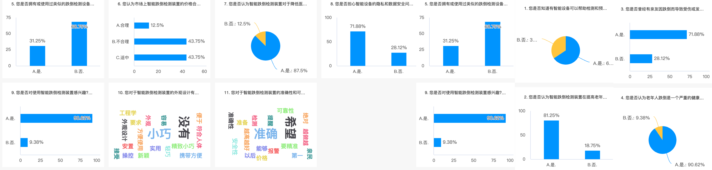
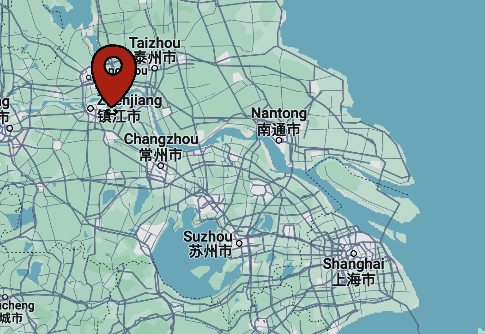

# FREE Device for AUTOMATIC Fall-Accident Detection !

### Initiative for developing these Free devices:
###### Falling acidents often occur among the elderly people. When they are alone at home or elsewhere, falling could be dangerous to them because they could get injuried without prompt cures. Such accidents is happening everyday. Some technology companies have developed intelligent watches to solve this problem. However, in some undeveloped country, the elderlys may not have the opportunity to get these watches since they are quite expansive. Moreover, it is not easy for them to use. To solve this problem, I generated the idea: developing a automatic fall-accident detection device, which only has one function: precisely detect the accident and tell the emergence to their family members or others to get prompt cure or other treatments. This device is easy to use and free. Actually, the cost of making such a device is only 1/10 of buying a watch. I will keep improving the device in both the aspect of hardware and software to make it more useful and cheap.

**_These devices are developed for: The elderly, disables and children._**

## Products
###### (The picture loading could be slow...)
### Outdoor Fall-Accident Detection

> 👉[Click here to access details on my Official Account!](https://mp.weixin.qq.com/s?__biz=Mzk0MTUyNzk0Mw==&mid=2247483863&idx=1&sn=d1e0ed87a6b0e2a22d3245d9fcdf6977&chksm=c2d0473ff5a7ce29acda677ce68c8e68d1afab0f85a8a9cf42ac1b9163411e5ec2c47cbe805d#rd)👈

---

### Indoor Fall-Accident Detection /planing to have my own version/

> 👉[Click here to view it on my Official Account!](https://mp.weixin.qq.com/s?__biz=Mzk0MTUyNzk0Mw==&mid=2247483810&idx=1&sn=8a458a1cdae362b880efcdbcb1219867&chksm=c2d0474af5a7ce5cccc3c3f7f2e4a55246ca912b6c0df61d225025c7af0a9ebb876062e20e0e#rd)👈

---
⬇️Scroll down to see more info!

##### -Questionaire Data
###### the first investigation

I made a investigation paper and over one hundred of pepole(including people from age 18-80) filled the questionaire, according to the data I made a conclusion for ⬇️

##### -The aspects that I will inculded in my first version
- The device should be small and portable 
- It should have high precision
- It cannot affect users' privacy
- It should be safe
- It should be easy for use

---
##### Feedbacks
Want to tell me something about the product?/ Want to have one?
###### 👉email to: Fall_detectemail@qq.com
---

##### Renovations

-Qustionaire link
###### ➡️[Click here to do the questionaire!](https://v.wjx.cn/vm/Q2Frjo2.aspx#)📝
---
#### helping map

---

## Follow Me!

> **Interested?**
> 
> Subscribe my Official Account[「智能与机械探索」](https://esperaa.github.io/WebextensionforAutome-/)and DM to me!
> 

#### Copyright

**_© 2024 Esper.S All rights reserved._**

